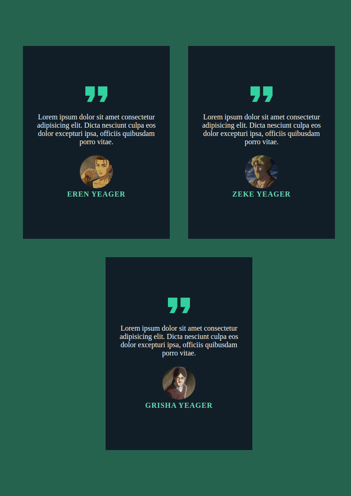
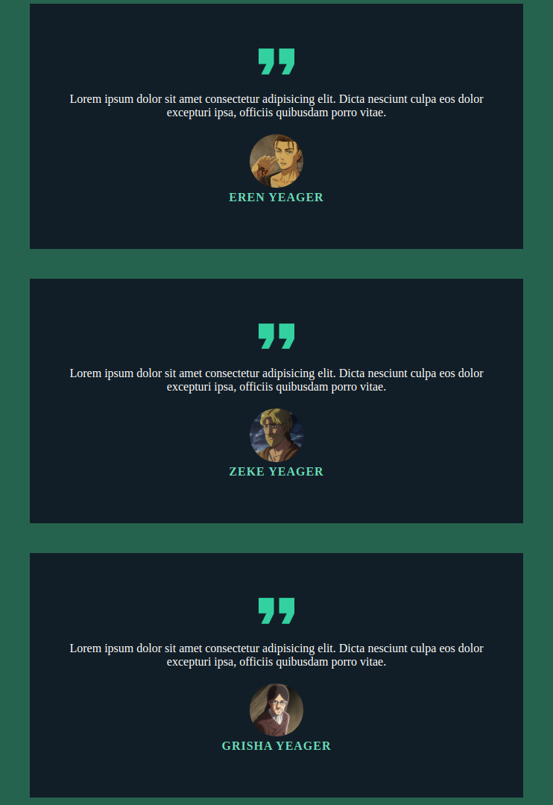
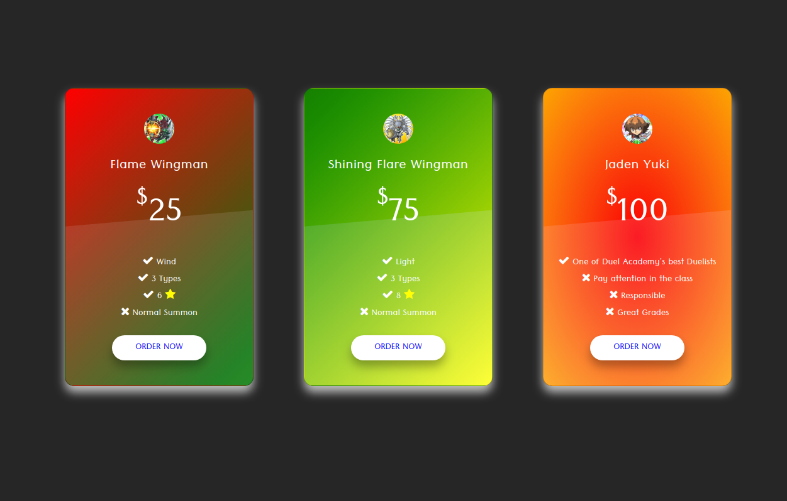
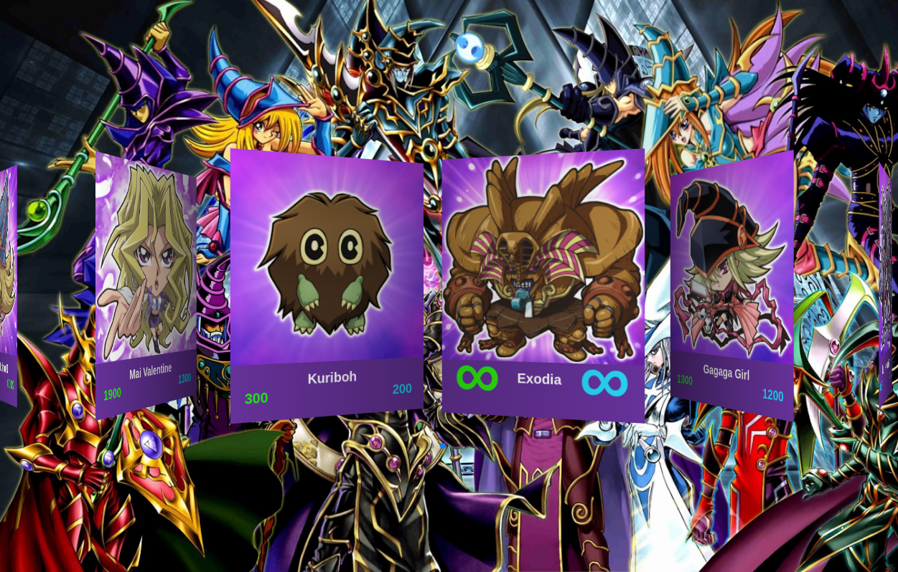
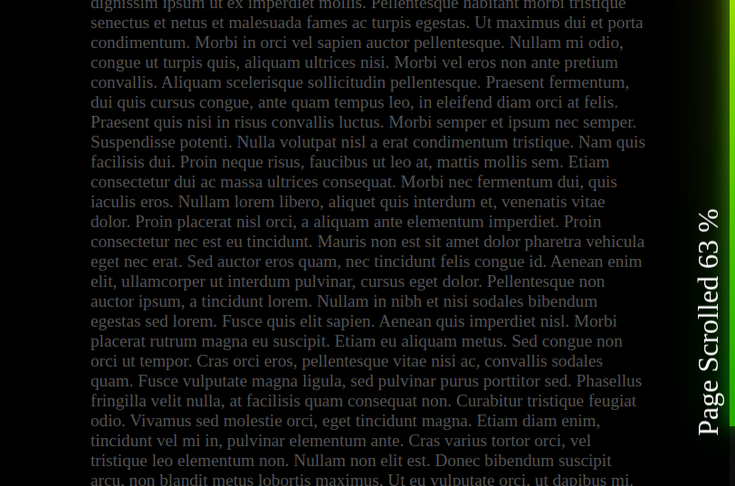
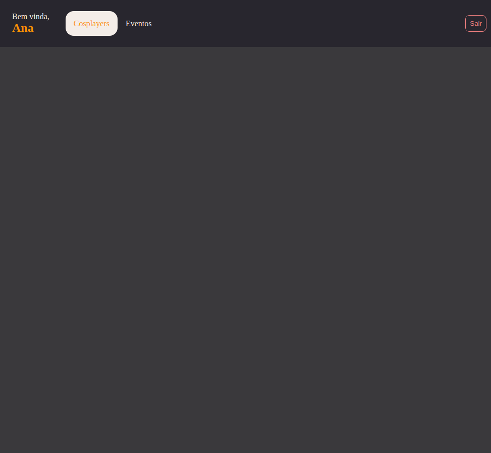

# Learning Every Day

## Shingeki no Kyojin 📅
 


## Testimonials from Yeager's 👨‍👦‍👦





## Price Table Ui 🤑




## Touch Slider Swiper 🃏

⚠️ It's necessary install Swiper. Run

```bash
npm install
```

[SwiperJs Github](https://github.com/nolimits4web/swiper)



## Page Scroll Progress Bar 📜

 



## Menu Ng Cosplay

